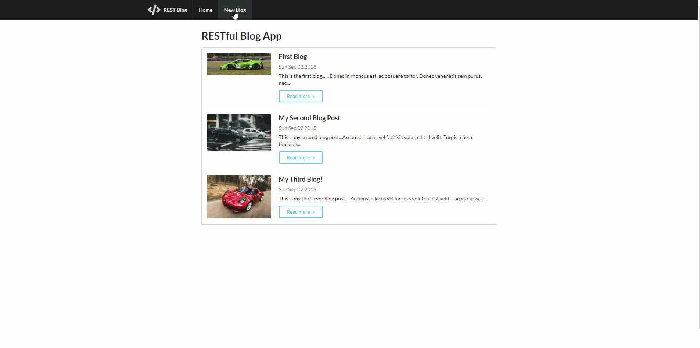

# RESTful-Blog-App
This is a dynamic web application built using Node.js, Express.js, MongoDB, Javascript, HTML5, and CSS3. 
The files were hosted on AWS Cloud9's IDE. Semantic UI was used for basic page styling.

### Details
- Learned about and implemented RESTful routing and CRUD operations
- Implemented a database to manage uploaded content
- Learned about method overriding for form PUT/DELETE requests

### Dependencies
- <a href="https://www.npmjs.com/package/express-sanitizer">express-sanitizer</a>
- <a href="https://www.npmjs.com/package/method-override">method-override</a>
- <a href="https://www.npmjs.com/package/body-parser">body-parser</a>
- <a href="https://www.npmjs.com/package/mongoose">mongoose</a>
- <a href="https://www.npmjs.com/package/express">express.js</a>
- <a href="https://www.npmjs.com/package/nodemon">nodemon</a>

